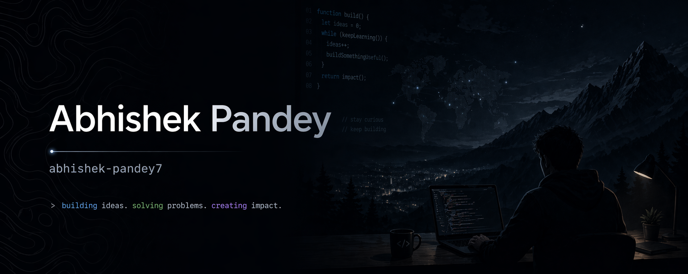

  

# Abhishek Pandey

 

**B.Tech Information Technology · DJSCE Mumbai · CGPA 9.12 / 10.0**

 

> I build systems that push the boundaries of what software can do autonomously - from real-time AI pipelines to desktop agents that see, reason, and act like a human. My work spans full stack engineering, computer vision, NLP, and agentic AI, with a relentless focus on making complex systems fast and reliable in production.

Currently researching **long-context reasoning in LLMs** as a mentee at **DJ Init.AI**.

 

---

##  Featured Project - AURA

**Automated Realtime Assistant** · *CLI-based autonomous AI agent*

AURA doesn't wait for instructions. It operates on a continuous **Observe → Think → Act → Verify** loop, writing code, running tests, fixing its own failures, and navigating any desktop visually without hardcoded coordinates.

| Module | What it does |
|---|---|
|  **Desktop Vision Engine** | Builds a live spatial map of UI elements, works on any app, any resolution |
|  **Imitation Learning** | Records your workflow via `pynput`, synthesizes it into reusable macros via a VLM |
|  **Browser Automation** | Playwright + Chrome profile persistence for authenticated, stateful web sessions |
|  **Self-Correcting Execution** | Recovers from failures mid-chain, runs autonomously for hours without babysitting |

`Python` `Playwright` `PyAutoGUI` `OpenCV` `OCR` `OpenAI-compatible LLMs`

 

---

## Projects

| Project | What I built | Stack |
|---|---|---|
| **Spine-Guard** | Real-time physiotherapy monitor - 33-landmark pose tracking, sub-30ms WebSocket inference, multimodal clinical AI assistant | React · FastAPI · MediaPipe · LangGraph · Gemini |
| **PhishNet** | Dual-threat detector combining NLP-based phishing analysis with deepfake audio detection via MFCC, spectral flatness, and ZCR | React · FastAPI · PyTorch · HuggingFace · Librosa |
| **Zero-Trust PII RAG** | Privacy-first RAG pipeline, all PII is cryptographically tokenized locally before any data reaches an LLM | Python · LangChain · ChromaDB · Presidio · Flask |
| **Football Advisor MAS** | 6-stage multi-agent system for scouting, tactical analysis, and transfer market intelligence | Google ADK · Gemini 2.0 · FastAPI |
| **MoodTune** | Voice-first music discovery, transcribes speech, infers emotional state, surfaces matched Spotify tracks | Flask · Vosk · Gemini API · Spotify API |

 

---

## Research

### Position-Aware Benchmarking for Long-Context LLMs
*DJ Init.AI · 2025 – Present*

Standard benchmarks like LongBench and SCROLLS miss a critical failure mode: LLMs systematically lose information buried in the middle of long contexts. I'm building a custom evaluation framework that exposes this, validating **U-shaped performance curves** across 32K–1M token windows, with up to **30% accuracy degradation at mid-context positions** that existing evals simply don't catch.

*Investigating the* ***Lost in the Middle*** *phenomenon.*

 

---

## Tech Stack

**Languages**

**Frontend**

**Backend**

**Databases**

**AI / ML**

**Tools**

 

---

## GitHub Stats

 

---

*Mumbai, India · Open to internships and collaborations*
 
If you're building something ambitious, let's talk.

